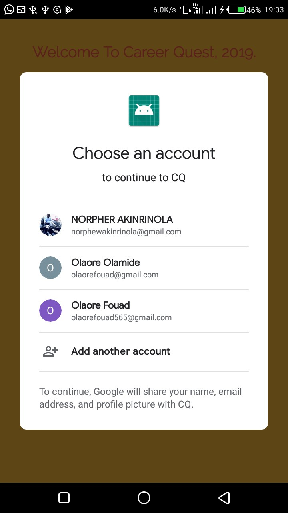

# Career Quest Application
Every year, Aptech Computer Education hosts an event, to publisize what the institute does. This event takes place in more than a hundred places around the entire world!. In 2019, I was a Semester Three Java/Android student, and i took it upon myself to develop an Android app for exhibition. An app i am still proud of till date, as its presentation went really well!

## The App
The app contains four basic functions. 

*Authentication:*
This allows a user (student, faculty, anyone), to sign in using *Gmail*. It gets the gmails accounts which have been used for auth before on the phone

*Home Section:*
After authentication, it navigates them to the Home page which contains a welcome message, and a list of the program events for the day. I implemented a bottom navigation view, so they could easily switch between fragments in the application. 

*Chat Section:*
They are also able to send in messages using the Chatroom. They can view past messages sent by everyone that has the app. It is a really nice way of maintaning communication.

*Students Section:*
The final segment is the Students Section. I built this part so the users would be able to see the students that are currently enrolled for one course or the other in Aptech. It states their hobbies, and what they do exactly.

## The application was built with...
* Android Mobile Framework
* Java Programming Language
* Material Design
* Firebase - (Database and Authentication)

       
